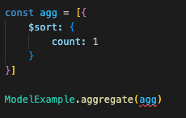
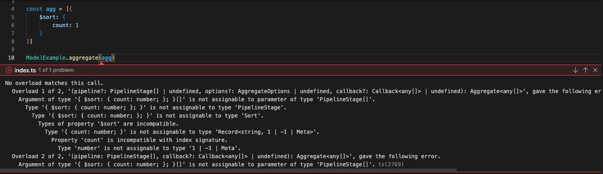
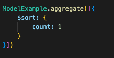

# Example mongoose type error

This repository contain an quickly example of the bug that occurs an type error on mongoose.

Here we have the section on code that are throwing the error
  

Type errors that have been thrown

  
This error was reported as an [issue on mongoose](https://github.com/Automattic/mongoose/issues/12678) repository.

Here we have only the necessary to reproduce the error. Typescript on version 4.8.4 and mongoose on version 6.5.3.

It's important to mention that the error only occurs if you declare a pipeline as a const and pass to the `Model.pipeline()` function.
Case you send the same param directly, it will works well.

Section of code that show working good.

